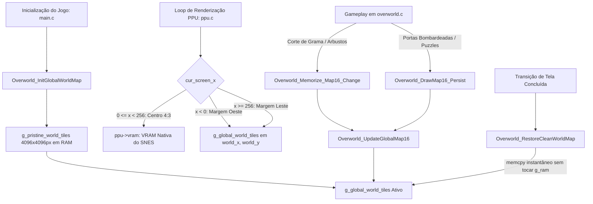

# Documentação Técnica: Widescreen Contínuo com Pré-Carregamento no Overworld (Zelda: A Link to the Past - Android Port)

## 1. Visão Geral e Objetivo
Os jogos originais de Super Nintendo (SNES) foram desenvolvidos para a proporção de tela **4:3** (resolução nativa de $256 \times 224$ pixels). Ao executar o jogo em dispositivos modernos widescreen (como 16:9 ou 20:9), a área fora dos limites nativos de 256 pixels tradicionalmente exibia bordas pretas ou sofria de artefatos de "wrap" circular da VRAM de 512 pixels do SNES.

O objetivo alcançado nesta implementação foi:
1. **Eliminar as bordas pretas** nas margens widescreen.
2. **Pré-carregar e exibir a continuação contígua real do cenário adjacente** (a oeste, leste, norte ou sul) para onde Link está caminhando.
3. **Preservar 100% da fidelidade e gameplay nativos** na área central (animações de água em tempo real, paletas dinâmicas, portas e eventos).
4. **Sincronizar em tempo real** modificações no cenário (cortes de grama, arbustos cortados, portas bombardeadas, estacas de quebra-cabeça).
5. **Garantir respawn correto de vegetação** e transições contínuas de rolagem sem barras pretas ou inversão de bordas.

---

## 2. Arquitetura da Solução



---

## 3. Detalhamento dos Arquivos Modificados e Criados

### 1. [overworld_seamless.h](file:///home/windroid/StudioProjects/PORT-ZELDA-ANDROID/app/jni/src/src/overworld_seamless.h) (Novo Arquivo)
Declara a API do subsistema de mapa global contínuo:
- `Overworld_InitGlobalWorldMap()`: Inicializa e descompacta os mapas mestre.
- `Overworld_GetGlobalTilemap(uint8 world)`: Retorna o ponteiro para a matriz de tiles do Light World (`0`) ou Dark World (`1`).
- `Overworld_UpdateGlobalMap16(uint8 world, int world_x, int world_y, uint16 map16_value)`: Atualiza um bloco de 16x16 pixels nas coordenadas mundiais.
- `Overworld_RestoreCleanWorldMap(uint8 world)`: Restaura a vegetação de telas antigas preservando eventos persistentes.

---

### 2. [overworld_seamless.c](file:///home/windroid/StudioProjects/PORT-ZELDA-ANDROID/app/jni/src/src/overworld_seamless.c) (Novo Arquivo)
Implementa a lógica do mapa contínuo:
- **Buffers Estáticos de Alta Velocidade:**
  - `g_pristine_world_tiles[2][512 * 512]`: Matriz base intocada de $4096 \times 4096$ pixels ($512 \times 512$ tiles de 8x8) para Light e Dark World.
  - `g_global_world_tiles[2][512 * 512]`: Matriz ativa manipulada durante o gameplay.
- **Descompressão Segura na Inicialização:**
  - As 64 telas de cada mundo são descompactadas e organizadas em sua grade geográfica $8 \times 8$.
  - Cada quadrante de $32 \times 32$ Map16s é convertido em $64 \times 64$ Map8s através da tabela `kMap16ToMap8`.
- **Restauração com Isolamento de Memória:**
  - `Overworld_RestoreCleanWorldMap()` utiliza `memcpy` direto a partir de `g_pristine_world_tiles`, sem executar rotinas de descompressão em tempo de execução, protegendo a memória temporária `g_ram[0x14000]` de qualquer corrupção.

---

### 3. [ppu.h](file:///home/windroid/StudioProjects/PORT-ZELDA-ANDROID/app/jni/src/snes/ppu.h) e [ppu.c](file:///home/windroid/StudioProjects/PORT-ZELDA-ANDROID/app/jni/src/snes/ppu.c) (PPU Widescreen)
- **Estrutura `Ppu` Estendida:**
  - Campos `extraOverworldTiles`, `extraOverworldWorldX`, `extraOverworldWorldY` e `extraOverworldAreaX` adicionados para transferir as coordenadas mundiais e o ponteiro do mapa global.
- **Amostragem Híbrida (`PpuFetchTile`):**
  ```c
  static inline uint32 PpuFetchTile(Ppu *ppu, uint layer, const uint16 *const tps[2],
                                     int cur_screen_x, int world_x, int world_y, uint x) {
    if (layer == 1 && ppu->extraOverworldTiles != NULL && (cur_screen_x < 0 || cur_screen_x >= 256)) {
      if (world_x < 0) world_x = 0;
      else if (world_x >= 4096) world_x = 4095;
      if (world_y < 0) world_y = 0;
      else if (world_y >= 4096) world_y = 4095;
      int tx = (world_x >> 3) & 511;
      int ty = (world_y >> 3) & 511;
      return ppu->extraOverworldTiles[ty * 512 + tx];
    }
    return tps[(x >> 8) & 1][(x >> 3) & 0x1f];
  }
  ```
- **Separação Rígida de Domínios:**
  - $0 \le cur\_screen\_x < 256$: Leitura da VRAM nativa com pipeline do SNES inalterado.
  - $cur\_screen\_x < 0$: Margem esquerda com cálculo $world\_x = cur\_screen\_x + BG2HOFS\_copy2$.
  - $cur\_screen\_x \ge 256$: Margem direita com cálculo $world\_x = cur\_screen\_x + BG2HOFS\_copy2$.

---

### 4. [zelda_rtl.c](file:///home/windroid/StudioProjects/PORT-ZELDA-ANDROID/app/jni/src/src/zelda_rtl.c) (Controle de Câmera e Margens)
- Em `ConfigurePpuSideSpace()`:
  - Mantém `extra_left = kPpuExtraLeftRight` e `extra_right = kPpuExtraLeftRight` sempre ativos no Overworld, inclusive durante a transição de rolagem (`submodule_index != 0`).
  - Passa `BG2HOFS_copy2` e `BG2VOFS_copy2` continuamente para a PPU.
  - Elimina qualquer flash ou interrupção com barras pretas durante o movimento da câmera.

---

### 5. [overworld.c](file:///home/windroid/StudioProjects/PORT-ZELDA-ANDROID/app/jni/src/src/overworld.c) (Sincronização de Eventos e Respawn)
- **Sincronização em Tempo Real:**
  - `Overworld_Memorize_Map16_Change()`: Propaga cortes de grama grossa (`0xdc5`) e arbustos (`0xdc9`) para o mapa global no momento da colisão.
  - `Overworld_DrawMap16_Persist()` e `Overworld_AlterTileHardcore()`: Propagam abertura de portas, entradas secretas explodidas com bombas e quebra-cabeças de estacas.
- **Restauração e Respawn:**
  - Em `Overworld_FinalizeEntryOntoScreen()`: Ao completar a travessia para uma nova tela, chama `Overworld_RestoreCleanWorldMap()`, fazendo a vegetação da tela anterior renascer conforme o comportamento autêntico do jogo.

---

### 6. [main.c](file:///home/windroid/StudioProjects/PORT-ZELDA-ANDROID/app/jni/src/src/main.c) (Inicialização)
- Inicializa o mapa contínuo global chamando `Overworld_InitGlobalWorldMap()` logo após `ZeldaInitialize()`.

---

## 4. Resumo das Etapas de Depuração Resolvidas

| Problema Encontrado | Causa Técnica | Solução Aplicada |
| :--- | :--- | :--- |
| **Inversão de Margens** | O buffer de VRAM do SNES é circular (512px); $x < 0$ acessava o extremo direito da mesma tela. | Amostragem externa na PPU via coordenadas absolutas $(world\_x, world\_y)$ no mapa global. |
| **Borda Preta Rápida no Scroll** | Trava temporária forçando `extra_left = 0` quando `submodule_index != 0`. | Remoção da trava, mantendo as margens widescreen abertas continuamente. |
| **Arbustos não Renasciam** | Modificações gravadas permanentemente sem ciclo de restauração. | Implementação de `Overworld_RestoreCleanWorldMap` restaurando a matriz base. |
| **Conflito de Cenários ao Trocar de Tela** | Descompressão em runtime corrompia `g_ram[0x14000]` e `map16_decode_last`. | Uso de `g_pristine_world_tiles` pré-descomprimido com restauração via `memcpy` rápido. |
| **Inversão pós-Scroll** | `dung_bg2` desatualizado (da tela anterior) sendo copiado sobre a nova tela. | Eliminação da cópia de `dung_bg2`, preservando apenas eventos salvos persistentes. |

---

## 5. Validação de Compilação
O projeto compila de forma limpa para todas as arquiteturas Android suportadas:
- `arm64-v8a`
- `armeabi-v7a`
- `x86`
- `x86_64`

Comando de validação:
```bash
./gradlew assembleDebug
```
**Resultado:** `BUILD SUCCESSFUL`
